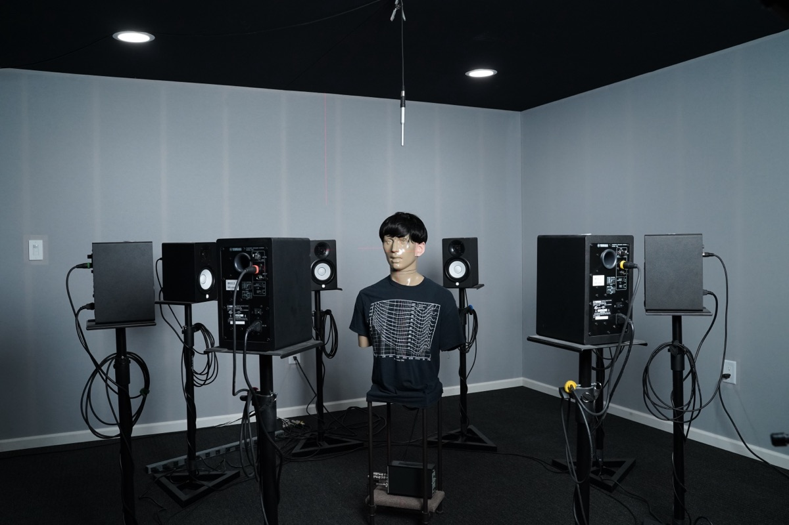

# Laboratory Setup

## Room and Equipment

The earplug evaluations use the same custom acoustic testing laboratory as our [hearing device evaluations](../hearing-devices/laboratory-setup.md), with slightly different measured room properties due to ongoing improvements.

The walls and ceiling are filled with sound-absorbing material between studs (e.g., RockWool Safe 'n Sound Insulation) and the floor is carpeted.

| Parameter | Value |
|---|---|
| Ambient sound pressure level | 34 dB LAeq (A-weighted) |
| 4-frequency average RT60 (0.5, 1, 2, 4 kHz) | 0.059 s |
| Estimated critical distance | 1.5 m |

We installed a ring of 8 speakers (Yamaha HS5) with a radius of 1 m -- ensuring that at the center of the ring the direct sound from the speakers dominates any room reverberation. Each speaker is equalized to be flat (\(\pm\) 2 dB) from 50 to 15,000 Hz.

*Figure 1. Test lab floorplan (3.96 m x 3.96 m room with 8-speaker ring)*

We placed an acoustic manikin (KEMAR 45BA) in the center of the speaker ring. The height of its artificial pinnae was aligned with the high-frequency drivers (tweeter) of the speakers. The manikin has:

- Anthropometric pinnae (KB5000/KB5001)
- Standard IEC 60318-4[[4]](references.md) ear simulators (GRAS RA0401)
- A wig
- Internal cavities filled with sand

The microphone outputs are digitized by a high quality audio interface (Antelope Orion Studio).
