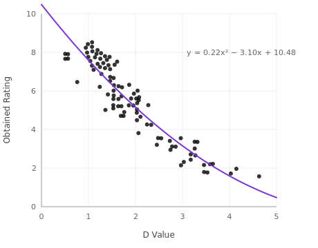

# Perceptual Sound Quality

## Overview

To evaluate sound quality we use a perceptual model designed to estimate the sound quality impacts of linear spectral distortions, based on data from Moore & Tan (2003)[[8]](../references.md) modeled in Moore & Tan (2004)[[9]](../references.md).

!!! warning "Passive Earplugs Only"
    This model is appropriate because passive earplugs act as linear filters. It may not be appropriate for active earplugs with nonlinear processing.

## Computing the Distortion Metric *D*

We compute the metric *D* as described by Tan and Moore (2004)[[9]](../references.md) using the "Final" free parameters (their Table 1, right column) that had the highest correlation to human judgments of both speech and music sound quality.

### Procedure

1. **Loudness equalization:** Both the open ear and earplug-inserted recordings are scaled to the same loudness (100 Phons)
2. **Excitation patterns:** Cochlear excitation patterns are computed for each signal using the `moore1997` model in the Auditory Models Toolbox[[10]](../references.md), modified to apply the filter sharpening parameter (\(s = 1.5\))
3. **Floor application:** A floor (\(f = 32\) dB) is applied to both excitation patterns
4. **Difference computation:**
    - **First order:** Signed difference of magnitude between open and earplug-inserted patterns
    - **Second order:** Signed difference of local slope
5. **Frequency weighting:** Differences are multiplied by a frequency weighting function using the fitted free parameter (\(w_s = 0.5\))
6. **Combination:** Standard deviations of first- and second-order differences are computed separately and combined using the final free parameter (\(w = 0.4\))

The resulting value *D* has a strong negative curvilinear correlation with human judgements of sound quality.

## Transforming *D* to Predicted Quality

We transform *D* to have a linear and positively-correlated relationship to perceptual judgements using a second-order polynomial fitted to the data from Moore & Tan (2004)[[9]](../references.md):

\[
y = 0.2x^2 - 3.1x + 10.5
\]

*Figure 2. Mapping D to Sound Quality. Data points replotted from Moore & Tan (2003). Polynomial fitted to these data is shown and used to transform D to estimate average rating.*

This transforms *D* to a scale where 1 is worst quality and predicted quality increases linearly up to 10.

## Mapping to 0--5 Scale

As with the loudness reduction metric, values are computed separately for each of the 10 earplug insertions and the **median** is taken. Scores are normalized by the highest observed score (7.2) in our initial set of 24 earplug conditions and scaled:

- **0** = worst quality
- **5** = best quality

!!! note
    If a future earplug exceeds the normalization anchor, its score would exceed 5.0. In this case, we would update the anchor and re-normalize all scores.
