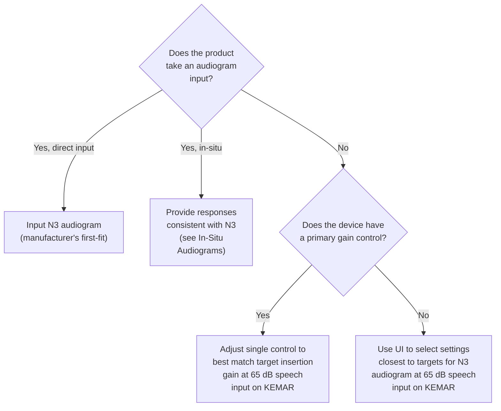
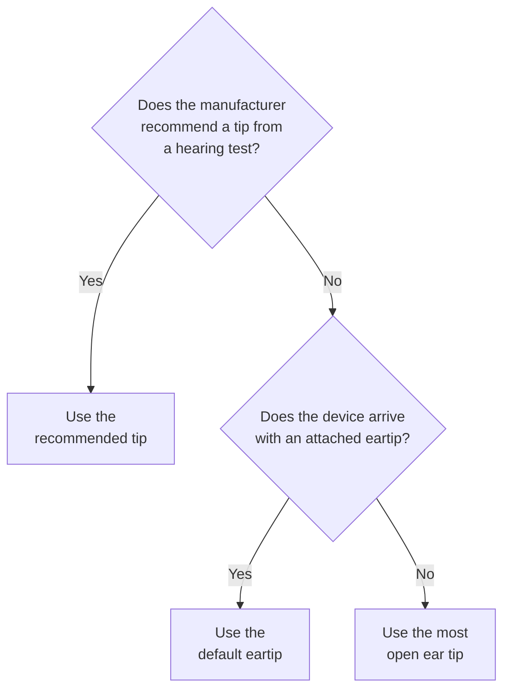
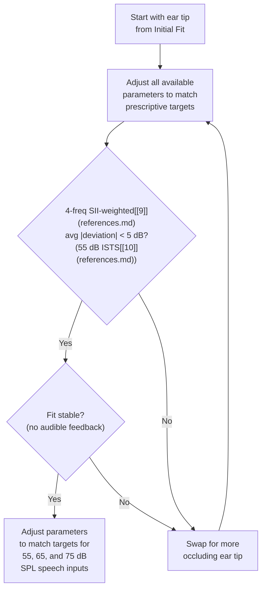
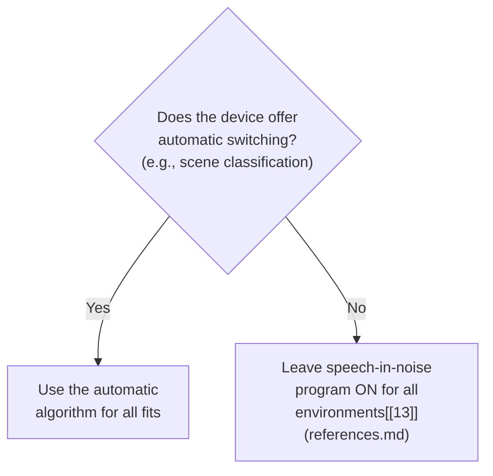

# Device Settings

## Hearing Loss

We chose to target the standard sloping moderate hearing loss from Bisgaard et al. (2010)[[6]](references.md) (N3 configuration; see Table 1). We chose this loss because:

1. It is reasonably common
2. It is near the middle of the overall aided population
3. It is a loss that can be appropriate for either prescription or OTC devices

We approached fitting decisions by considering what would be appropriate for the average consumer with a binaural sensorineural hearing loss with the N3 configuration.

**Table 1. N3 Audiogram.** Values in Hz (top) and dB HL (bottom).

| 250 | 375 | 500 | 750 | 1k | 1.5k | 2k | 3k | 4k | 6k |
|-----|-----|-----|-----|-----|------|-----|-----|-----|-----|
| 35 | 35 | 35 | 35 | 40 | 45 | 50 | 55 | 60 | 65 |

Prescription targets are computed using NAL-NL2[[7]](references.md) prescription with unspecified gender, non-tonal language, and prior hearing aid experience. Each hearing aid was recorded in two configurations -- "Initial" and "Tuned" -- that differ in their gain settings and ear couplings (see [Initial Fit](#initial-fit) and [Tuned Fit](#tuned-fit)).

## Initial Fit

Our goal for the initial fit was to approximate the settings that a user would experience if the person fitting the device just followed basic instructions.

### Figure 3a. Initial Fit -- Gain Parameters

### Figure 3b. Initial Fit -- Ear Tip Selection

We reasoned that most individuals fitting the device would start with the most open ear tip to minimize occlusion.

## Tuned Fit

Our goal for the Tuned fit was to approximate the settings that a user would experience if the person fitting the device performed a more thorough fitting. Specifically, the tester adjusted all available parameters and ear tips to match prescriptive targets for quiet and loud inputs.

### Figure 4. Tuned Fit Procedure

**Success criterion:** A 4-frequency (0.5, 1, 2, 4 kHz) SII-importance-weighted[[9]](references.md) average absolute deviation from prescription of less than 5 dB (with a 55 dB International Speech Test Signal -- ISTS[[10]](references.md)). The fit must be **stable** -- meaning no audible feedback.

## "Real Ear" Measures

Several aspects of our initial and tuned fittings rely upon the equivalent of Real Ear Measures (REMs)[[11]](references.md). We replicated this procedure on the manikin via real-time spectral analysis (&#8531; octave filterbank) of the eardrum microphone.

During fitting, we presented a calibrated speech signal (ISTS [[10]](references.md)) and computed the difference at the eardrum mic between the aided and unaided conditions. The resulting value (Insertion Gain) could be visually compared to the prescriptive targets via a custom interface.

This interface was used:

- When performing some initial fits (without an audiogram)
- All tuned fits
- While measuring occluded response during device insertion

## In-Situ Audiograms

Several devices were fitted using an audiogram that was performed using the device itself (i.e., an in-situ audiogram). In this case, we provided responses that were consistent with the N3 hearing loss (Table 1).

We performed real-time spectral analysis (&#8531; octave filterbank) on the eardrum microphone during the test. The spectrum could be visually compared to the sound level equivalent to the auditory thresholds of the N3 hearing loss via a custom interface. The tester responded positively for signals above threshold and negatively for signals below threshold.

We validated this approach using the Mimi app for iOS using wired Apple EarPods (with their correction for these earbuds). The resulting audiogram was within < 5 dB of N3 at all frequencies.

## Noise Settings

We also considered the settings that influence conversation in noise.

### Figure 5. Noise Processing Settings

