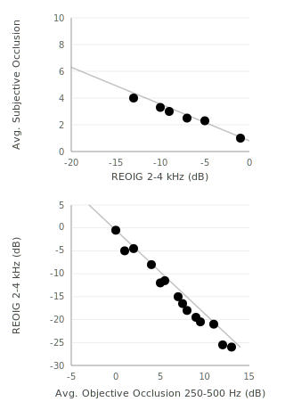

# Occlusion

## Overview

Own-voice quality is a common complaint of hearing aid users[[16]](../references.md) and can be attributed to two factors:

1. **Occlusion** -- bone-conducted sound becomes trapped in the ear canal due to the physical seal of the device
2. **Amplification** -- the receiver-transmitted sound alters own-voice perception

For these initial metrics, we chose to focus on **occlusion**, which is the larger contributor to user complaints[[17]](../references.md).

## Goal

Our goal was to estimate *subjective occlusion* (a user's rating of their perceived occlusion on a 0--10 scale, as in Cubick et al. 2022[[18]](../references.md)) via acoustic measurements.

## Measurement: REOIG

We measure **Real Ear Occluded Insertion Gain (REOIG)** -- the difference in spectrum between the open ear and the aided ear with the device powered off[[18]](../references.md). We reasoned that acoustic coupling that generates high subjective occlusion usually also generates more negative REOIG (excluding deep-insertion devices).

### Devices Without Active Occlusion Cancellation

Using data from Cubick et al. (2022)[[18]](../references.md), we observed that the group average REOIG from **2--4 kHz** for instant-fit tips had a strong linear correlation to the group average subjective occlusion (Figure 6A). We use this relationship to map from REOIG to estimated subjective occlusion.

### Devices With Active Occlusion Cancellation (AOC)

For devices with AOC[[19]](../references.md), the passive REOIG measurement does not capture the influence of cancellation on subjective occlusion. For these devices, we instead measure **objective occlusion on vocalizing humans**.

Objective occlusion is the difference in probe mic spectra between the open ear and the aided ear while the participant vocalizes a sustained /i/ (as in Kuk et al. 2009[[20]](../references.md)):

\[
\text{Objective Occlusion} = \text{REAR}_{\text{VOC}} - \text{REUR}_{\text{VOC}}
\]

We then use a two-step estimation to place AOC devices on the same subjective scale:

1. **Map from objective occlusion to a matched REOIG value:** We replotted data from Sabin (2020)[[19]](../references.md) (their Figs. 4 and 7) and observed a strong linear correlation between group average objective occlusion in the **250--500 Hz band** and the group average REOIG from 2--4 kHz (Figure 6B).
2. **Map from matched REOIG to subjective occlusion:** Using the same relationship as for non-AOC devices (Figure 6A).

!!! note
    This two-step estimation introduces compounding uncertainty, as each mapping step carries its own measurement error. We consider this acceptable given the limited alternatives for estimating subjective occlusion in AOC devices.

*Figure 6. (Top) Relationship between REOIG and subjective occlusion, replotted from Cubick et al. (2022)[[18]](../references.md). (Bottom) Relationship between REOIG and objective occlusion, replotted from Sabin (2020)[[19]](../references.md).*

## Mapping to 0--5 Scale

The estimated subjective occlusion value is inverted and scaled to our 0--5 scale:

- **5** = minimal or no occlusion (open fit)
- **0** = severe occlusion (deeply occluding fit with no vent)

Higher scores are better -- they indicate that the device coupling allows low-frequency energy to escape the ear canal naturally.
