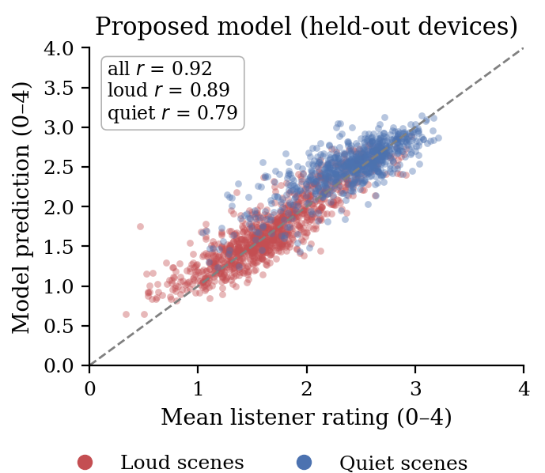

# Speech Perception Benefit

## Overview

We quantify the expected improvement in speech understanding for each device/fit combination via acoustic measurement. The published score is the average of two complementary components computed on the same recordings:

| Component | What it Captures | Grounded In |
|---|---|---|
| Intelligibility (\(\Delta\)HASPIv2) | Predicted speech intelligibility for an impaired auditory system | Peer-reviewed intelligibility research[[14]](../references.md) |
| Listener-rated ease of understanding | Predicted consumer ratings of how easy speech is to understand | 100,000+ blind ratings from hearing aid consumers[[27]](../references.md) |

The two components are deliberately different in spirit. HASPIv2 is a model of the impaired auditory periphery developed by hearing scientists and validated against objective intelligibility measures — it represents the professional research perspective. The second component is a machine-learning model trained on more than 100,000 ratings collected through our Blind Listening Challenge, in which website visitors with hearing loss rate recordings of unlabeled devices — it represents the perspective of real hearing aid consumers. Averaging the two yields a score informed equally by intelligibility research and by user preference.

## Computation

### Intelligibility Component (\(\Delta\)HASPIv2)

We compute HASPIv2 using the N3 audiogram ([Table 1](../device-settings.md#hearing-loss)) and RAU-transform[[15]](../references.md) the output. We average across both ears and compute the difference between unaided and aided recordings:

\[
\Delta\text{HASPIv2} = \text{HASPIv2}_{\text{aided}} - \text{HASPIv2}_{\text{unaided}}
\]

Positive values indicate the hearing aid improved speech intelligibility; negative values indicate degradation.

### Listener-Rated Component

The second component is produced by a model trained to predict listener-rated ease of speech understanding directly from audio. The aided recording and a matched clean-speech reference are each passed through a frozen speech foundation model (the Whisper encoder), and the difference between their internal representations is mapped to a predicted listener rating by a small trained network.

The training data come from our Blind Listening Challenge: over 100,000 quality-screened ratings in which website visitors with hearing loss rated recordings of unlabeled devices on a five-point ease-of-understanding scale. The dataset — 83 commercial products recorded across 72 realistic acoustic scenes — and the model are described in full in Sabin et al. (2026)[[27]](../references.md).

The figure below shows each metric against the mean listener rating. For the proposed model (right), predictions are for devices that were entirely held out of training. The model tracks consumer ratings substantially more closely than HASPIv2 in both loud and quiet scenes:

*Each point is one device fit in one background scene. Left: HASPIv2 vs. mean listener rating (r = 0.83 overall). Right: the listener-rated model on held-out devices (r = 0.92 overall). Reproduced from Sabin et al. (2026)[[27]](../references.md), Figure 2.*

### Quiet/Moderate vs. Loud Environments

We report both components separately for two environment categories:

| Sub-metric | Environment Criterion |
|---|---|
| Speech Perception Benefit (Quiet/Moderate, 5 background) | Background level < 70 dB SPL |
| Speech Perception Benefit (Loud, 7 background) | Background level > 70 dB SPL |

For each category, we average each component across all qualifying acoustic scenes.

## Mapping to 0--5 Scale

The intelligibility component is mapped to our 5-point scale via linear scaling, as in previous versions of this methodology: a \(\Delta\)HASPIv2 of 0 (no benefit relative to the open ear) maps to 0 on our scale, with increasing benefit scaled linearly up to 5.

The listener-rated component is linearly rescaled so that its distribution of scores across all tested devices matches the distribution of the scaled intelligibility component. This ensures the two components contribute comparably to the final score and that published scores remain comparable to previous versions of this methodology.

The published Speech Perception Benefit score is the unweighted mean of the two components:

\[
\text{Speech Perception Benefit} = \frac{\text{Intelligibility} + \text{Listener-rated}}{2}
\]

Both components are bounded below at 1.0 before averaging, so the published score does not distinguish among devices at the extreme low end of the scale.
