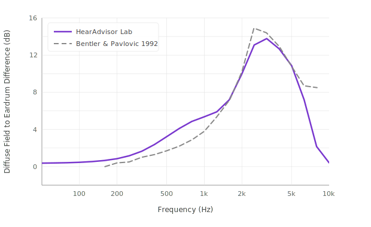

# Recordings

## Acoustic Scenes

We created a set of acoustic scenes that represent a wide range of environments and conversations.

**Backgrounds:** The 12 recordings from the ARTE database[[2]](references.md) were decoded to the 8 channels of our 2D speaker ring (HOA Order = 3). Each background's presentation level was adjusted to match the published values that were observed in the real environment. To ensure consistency with each background, any 5-second segment that was more than 5 dB from the average of all 5-second segments was removed.

**Speech:** We recorded a custom set of conversations by hiring actors to read scripts in a recording studio. To elicit potential Lombard effects, the associated background sounds were played into the actor's headphones during recordings. For each background there were 3 scripts (1, 2, and 3 talkers). Each script was performed twice (rotating actors).

### Spatial Configuration

The speech recordings were combined with the backgrounds in realistic spatial locations:

| Number of Talkers | Speaker Positions |
|---|---|
| 1 talker | 0° (on-axis) |
| 2 talkers | -45° and +45° |
| 3 talkers | -45°, 0°, and +45° |

To match the reverberation between the talker and background, the talkers were convolved with the multichannel impulse response from the ARTE database that was matched to the scene (without "direct sound enhancement"). When talkers were not at 0° azimuth, the multichannel impulse response was rotated to match the direct path to the location of the talker.

### Presentation Levels

The presentation level of each talker was set to follow the relationship described in Wu et al. (2018)[[3]](references.md) between environment SPL and signal-to-noise ratio (their Fig. 3B) as observed in individuals with hearing loss.

Each scene had at least 15 seconds of just background at the beginning to allow the hearing aid to adapt. Then each script from the same scene was played back-to-back (allowing for even more adaptation where necessary).

!!! summary "Scene Summary"
    - **Total scenes:** 72 (12 environments &times; 3 numbers of talkers &times; 2 actor variations)
    - **Average scene duration:** 34.9 s (s.d. 4.5 s)

## Device Insertion

We attempted to insert devices in a way that creates a symmetrical fit and the appropriate acoustic seal. The tester monitored the real-time insertion loss (see [Real Ear Measures](device-settings.md#real-ear-measures)) while inserting the powered-off device. The devices were adjusted until they had:

1. The expected overall insertion loss shape for their coupling (e.g., low pass for semi-occluding)
2. A between-ear difference of < 5 dB at 1 kHz

The resulting measurement (Real-Ear Occluded Insertion Gain) was used in our measure of [occlusion](metrics/occlusion.md). Water-based lubricant was used for devices that had difficulty creating a seal on the manikin's ear.

## Music Streaming

We assessed streaming music quality by playing five genres of recorded (royalty-free) music from a paired smartphone to the manikin wearing the device. On average, the segments were 33.7 seconds (s.d. 5.9 s).

The phone volume was adjusted to match a reference level using real-time spectral analysis of the eardrum mic of the manikin (see [Real Ear Measures](device-settings.md#real-ear-measures)). That reference level was derived by presenting a custom steady noise whose spectrum was matched to that of the average across music signals via the speaker ring at 70 dB SPL (a common level[[4]](references.md)). The tester adjusted the streaming level from the phone until the hearing aid's level matched that of the reference curve at 1 kHz (&#8531; octave filter) within 5 dB.

## Post-Processing

Minimal post-processing was applied to make sure the recordings were suitable for presentation over headphones.

**Diffuse field equalization:** We performed a diffuse field equalization to remove the acoustic effects of the manikin's anatomy from the recording. We fit a filter to the spectral difference between KEMAR's eardrum microphones and a flat reference mic. Each measurement was taken with the microphone in the center of the speaker ring, while the speakers were emitting uncorrelated white noise. The resulting filter shape largely matches the published values[[5]](references.md). Some deviation is expected due to the 2D ring of speakers here vs. the 3D environment in their report.

*Figure 2. Diffuse-field equalization curves. Comparison of HearAdvisor lab measurement with Bentler & Pavlovic (1992).*

**Level mapping convention:** We needed to choose a convention of mapping dB SPL in the laboratory to dB FS in a sound file for online presentation. For this decision there is a tradeoff between clipping (when recordings are too loud) and noise or extreme volume settings needed from the playback system (when recordings are too quiet). Through trial-and-error we determined that a mapping of 0 dB FS = 100 dB SPL is a compromise that minimizes (but doesn't eliminate) clipping while allowing our scenes to be well above the noise of typical playback systems.
